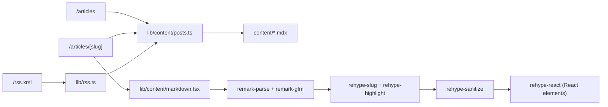

# ✦ undefined-art — Blog

[](https://github.com/undefined-art/blog/actions/workflows/ci.yml)
[](https://github.com/undefined-art/blog/actions/workflows/deploy.yml)
[](LICENSE)

A static, SEO-friendly developer blog built with **Next.js 16 (App Router)**, **MDX/remark** and **Tailwind CSS**. Content lives in version-controlled `.mdx` files, and the site is fully prerendered and deployed to GitHub Pages.

## ✨ Features

- Static generation (`output: export`) — zero server, instant TTFB
- Client-side article search, tag filtering, sorting and pagination
- Syntax-highlighted code blocks, GFM tables, footnotes-friendly headings with anchor links
- RSS 2.0 feed (`/rss.xml`)
- Dark/light theme with local persistence
- WebGL aurora background (pauses when the tab is hidden, respects `prefers-reduced-motion`)
- Full quality gate: typecheck, lint, format, unit tests, dependency audit

## 🏗️ Architecture



- **`src/lib/content/posts.ts`** — cached content repository: reads and parses every article exactly once per build.
- **`src/lib/content/frontmatter.ts`** — Zod-validated frontmatter; a malformed article fails the build loudly.
- **`src/lib/content/markdown.tsx`** — server-side markdown → React pipeline with built-in sanitization (no `dangerouslySetInnerHTML`, no client-side parsing).
- **`src/components/articles/`** — presentational components driven by the `useArticleFilters` hook.

## 🚀 Getting Started

```bash
npm install
npm run dev
```

Open [http://localhost:3000/blog/](http://localhost:3000/blog/).

## ✍️ Writing an Article

Use the scaffolder (interactive or flag-based):

```bash
npm run new -- -t "My Title" -d "Short description" --tags "web,dev"
```

Or create `content/articles/<slug>.mdx` manually:

```mdx
---
title: 'My Title'
description: 'A brief description'
date: '2026-01-01'
tags: ['web', 'dev']
image: '/images/cover.jpg' # optional; place files in public/images/
---

Your markdown content here. Supports headings, lists, tables, code fences,
blockquotes, images and **inline** formatting. Links open in a new tab.
```

### Frontmatter fields

| Field         | Type         | Required | Default |
| ------------- | ------------ | -------- | ------- |
| `title`       | `string`     | ✅       | —       |
| `description` | `string`     | —        | `""`    |
| `date`        | `YYYY-MM-DD` | —        | today   |
| `tags`        | `string[]`   | —        | `[]`    |
| `image`       | `string`     | —        | none    |

## 🔍 Public API

| Endpoint            | Description                                  |
| ------------------- | -------------------------------------------- |
| `GET /blog/rss.xml` | RSS 2.0 feed of all articles (cached 1 hour) |

## 🧰 Scripts

| Command                | Description                         |
| ---------------------- | ----------------------------------- |
| `npm run dev`          | Development server                  |
| `npm run build`        | Production build (static export)    |
| `npm run typecheck`    | TypeScript type check               |
| `npm run lint:check`   | ESLint (flat config, Next.js rules) |
| `npm run format:check` | Prettier check                      |
| `npm test`             | Vitest unit tests                   |
| `npm run audit`        | npm security audit (high severity)  |
| `npm run new`          | Scaffold a new article              |

Quality gates run automatically on every commit (Husky + lint-staged + commitlint) and in CI.

## 🚢 Deployment

Pushes to `main` deploy via [GitHub Actions](.github/workflows/deploy.yml) to GitHub Pages at **https://undefined-art.github.io/blog/**.

The workflow: typecheck → lint → format check → tests → build → publish the `out/` artifact. The site is served under the `/blog` base path (see `next.config.mjs` and `src/lib/site.ts`).

## 🧱 Tech Stack


## 📄 License

MIT — see [LICENSE](LICENSE).
